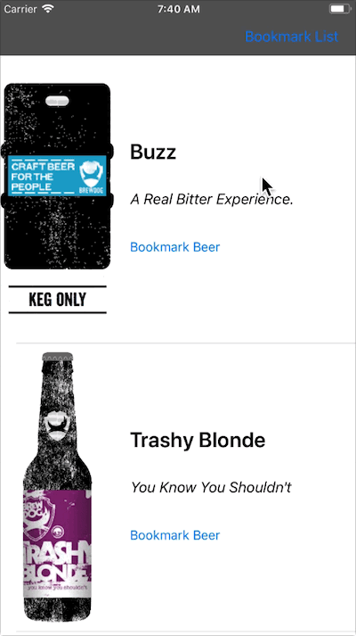
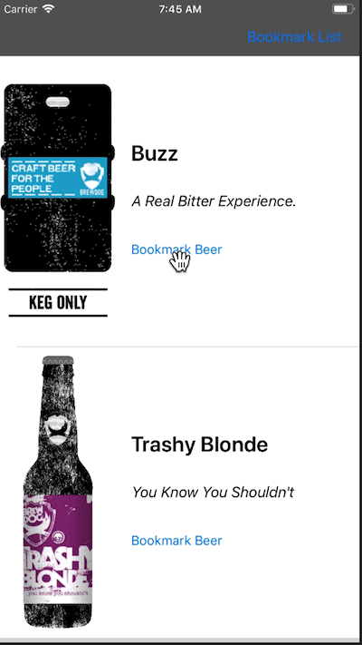

# beer-store

An iOS app to consult and bookmark your favorites beers. Here you can access the data source: [Punk API](https://punkapi.com/documentation/v2).

---

## Preview

You can consult a beer description and bookmark it.  
 

You can consult your bookmarked beers too.  


## Table of Contents

- [Usage](#usage)
- [Contributing](#contributing)
- [License](#license)

## Usage

### Getting Started

Make sure you have the main dependencies:

- [Git](http://git-scm.com/downloads)
- [CocoaPods](https://cocoapods.org/)

Clone this repository:

```sh
$ git clone https://github.com/falcaoaugustos/beer-store.git
```

Install all dependencies:

```sh
$ cd beer-store
$ pod install
```

Open the **beer-store.xcworkspace** file and build the project.

## Contributing

Contributions are very welcome! If you'd like to contribute, feel free to send a pull request!

## License

beer-store is released under an MIT license. See LICENSE file for more information.
